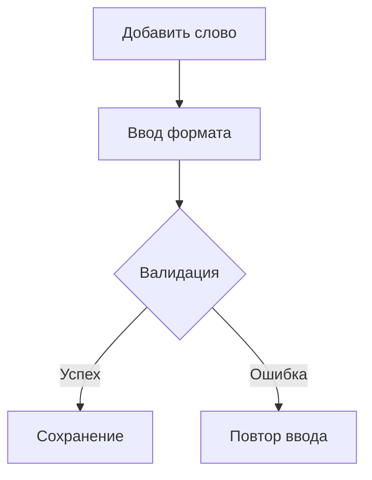
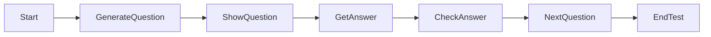
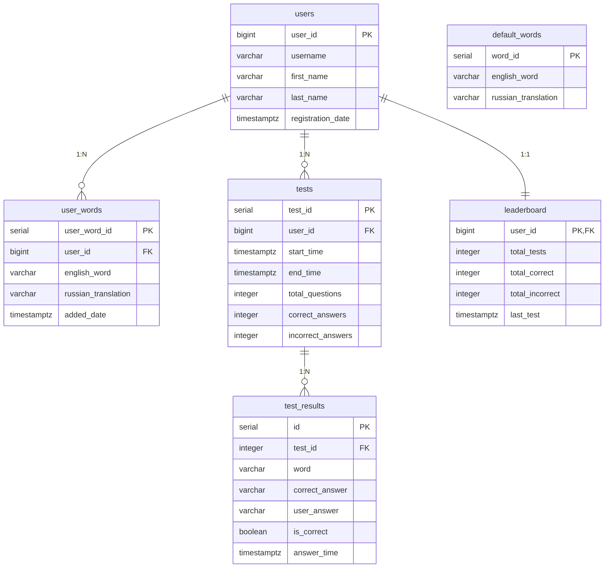

> # **English Trainer Bot**

Telegram-бот для изучения английских слов с функциями словаря, тестирования и отслеживания прогресса.

> ## 📁 Структура проекта
>```Py
>.../HW5-7-KursovayW-TelegramBT-LearnEnglish/
>├── bot.py # Основной модуль бота (обработчики команд)
>├── database.py # Работа с PostgreSQL (ORM-слой)
>├── learning_test.py # Логика тестирования пользователя
>├── translator.py # Модуль перевода слов
>├── config.py # Конфигурация приложения
>├── .env # Переменные окружения
>├── requirements.txt # Зависимости Python
>└── dictionary.xml # XML-словарь для перевода
>```
___
___
___
> ## Детализация модулей
___
___
___


>### bot.py

## Основные компоненты системы

### 1. Инициализация и конфигурация
```python
# Инициализация бота
bot = Bot(token=os.getenv("BOT_TOKEN"))
dp = Dispatcher()

# Настройка логирования
logging.basicConfig(
    level=logging.INFO,
    format='%(asctime)s - %(name)s - %(levelname)s - %(message)s'
)
```

Основные функции:

- Инициализация бота и диспетчера

- Обработка команд:

        /start - приветствие и главное меню

        /history - история тестов

        /last_test - результаты последнего теста

- FSM-состояния:

        ADDING_WORD - добавление новых слов

        REMOVING_WORD - удаление слов

        TRANSLATING_WORD - режим перевода

        TEST - процесс тестирования

- Система клавиатур:

        Динамические инлайн-клавиатуры

        Reply-клавиатуры для FSM-состояний

- Интеграция с другими модулями

- Ключевые обработчики:
    ``` Text
     start_command - инициализация пользователя

     show_word_translation - отображение перевода

     process_add_word - добавление слова в словарь

     start_test_handler - запуск теста

     test_answer_handler - обработка ответов в тесте
    ```
- Состояния FSM (Finite State Machine)
```Python

class Form(StatesGroup):
    ADDING_WORD = State()       # Добавление новых слов
    REMOVING_WORD = State()     # Удаление слов
    TRANSLATING_WORD = State()  # Перевод слов
    ADDING_TRANSLATION = State()# Ручное добавление перевода
    TEST = State()              # Состояние тестирования
```
>**Ключевые функции**

- Управление словарем `create_words_keyboard()`

    - Назначение: Динамическая клавиатура слов

    - **Особенности:**

        -    Пагинация (6 слов/страница)

        -    Объединение стандартных и пользовательских слов

        -    Кнопки навигации и действий

- Обработчики:

    - `start_add_word()`: Инициирует добавление слова

    - `process_add_word()`: Обрабатывает ввод формата "слово - перевод"

    - `start_remove_word()`: Показывает список для удаления

    - `remove_word()`: Удаляет выбранное слово

>**Система перевода**
- Обработчики:

    - `start_translate()`: Активирует режим перевода

    - `translate_input()`: Обрабатывает запрос перевода

    - `add_translation_handler()`: Добавляет перевод вручную

> **Тестирование знаний**
- Обработчики:

    - `start_test_handler()`: Начинает новую сессию теста

    - `test_answer_handler()`: Проверяет ответы

    - `end_test_handler()`: Завершает тест с отчетом

> **История и статистика**
- Функции:

    - `show_test_history()`: Выводит историю тестов

    - `show_last_test_results()`: Детализация последнего теста

    - `show_last_test_details()`: Показывает детали теста

>**Полная схема работы**

- Старт бота (main())

    - Инициализация БД

    -   Запуск polling

- Главное меню (start_command())

    -    Клавиатура с действиями

    -    Навигация по словам
>Работа со словарем

>Процесс тестирования


> **Особенности реализации**

- Безопасность:

    -   Валидация ввода

    -   Обработка исключений

    -   Логирование ошибок

- Производительность:

    -    Кэширование данных

    -    Асинхронные запросы

    -    Оптимизированные запросы к БД

- UX-решения:

    -    Интерактивные клавиатуры

    -    Четкие инструкции

    -    Подробные отчеты


___
___
>### database.py
___
___
### Структура базы данных:
 База данных состоит из следующих таблиц:
   - users: хранит информацию о пользователях (user_id, username, имя, фамилия, дата регистрации).
   - default_words: стандартный набор слов (word_id, английское слово, русский перевод).
   - user_words: слова, добавленные пользователями (user_word_id, user_id, английское слово, русский перевод, дата добавления).
   - tests: сессии тестов (test_id, user_id, время начала, время окончания, общее количество вопросов, правильные ответы, неправильные ответы).
   - test_results: результаты каждого вопроса в тесте (id, test_id, слово, правильный ответ, ответ пользователя, правильность, время ответа).
   - leaderboard: таблица лидеров (user_id, общее количество тестов, общее количество правильных ответов, общее количество неправильных ответов, последний тест).


### Структура базы данных PostgreSQL

#### Таблица `users`
| Поле | Тип | Описание |
|------|-----|----------|
| `user_id` | BIGINT | Первичный ключ |
| `username` | VARCHAR(255) | Имя пользователя в Telegram |
| `first_name` | VARCHAR(255) | Имя |
| `last_name` | VARCHAR(255) | Фамилия |
| `registration_date` | TIMESTAMPTZ | Дата регистрации (МСК) |

#### Таблица `default_words`
| Поле | Тип | Описание |
|------|-----|----------|
| `word_id` | SERIAL | Первичный ключ |
| `english_word` | VARCHAR(255) | Английское слово (уникальное) |
| `russian_translation` | VARCHAR(255) | Русский перевод |

#### Таблица `user_words`
| Поле | Тип | Описание |
|------|-----|----------|
| `user_word_id` | SERIAL | Первичный ключ |
| `user_id` | BIGINT | Внешний ключ (users.user_id) |
| `english_word` | VARCHAR(255) | Английское слово |
| `russian_translation` | VARCHAR(255) | Русский перевод |
| `added_date` | TIMESTAMPTZ | Дата добавления (МСК) |

#### Таблица `tests`
| Поле | Тип | Описание |
|------|-----|----------|
| `test_id` | SERIAL | Первичный ключ |
| `user_id` | BIGINT | Внешний ключ (users.user_id) |
| `start_time` | TIMESTAMPTZ | Время начала теста |
| `end_time` | TIMESTAMPTZ | Время завершения теста |
| `total_questions` | INT | Всего вопросов |
| `correct_answers` | INT | Правильные ответы |
| `incorrect_answers` | INT | Ошибки |

#### Таблица `test_results`
| Поле | Тип | Описание |
|------|-----|----------|
| `id` | SERIAL | Первичный ключ |
| `test_id` | INT | Внешний ключ (tests.test_id) |
| `word` | VARCHAR(100) | Тестируемое слово |
| `correct_answer` | VARCHAR(100) | Правильный ответ |
| `user_answer` | VARCHAR(100) | Ответ пользователя |
| `is_correct` | BOOLEAN | Флаг правильности |
| `answer_time` | TIMESTAMPTZ | Время ответа |

#### Таблица `leaderboard`
| Поле | Тип | Описание |
|------|-----|----------|
| `user_id` | BIGINT | Первичный ключ (users.user_id) |
| `total_tests` | INT | Всего пройденных тестов |
| `total_correct` | INT | Всего правильных ответов |
| `total_incorrect` | INT | Всего ошибок |
| `last_test` | TIMESTAMPTZ | Время последнего теста |

## Диаграмма базы данных в DBeaver



# Основные методы:

    add_user() - регистрация пользователя

    add_user_word() - добавление слова в словарь

    get_user_words() - получение слов пользователя

    create_test_session() - старт новой сессии теста

    add_test_result() - сохранение результата вопроса

    update_leaderboard() - обновление статистики

>## Модуль learning_test.py


Модуль отвечает за логику тестирования пользователей в боте для изучения английских слов.

## Основные функции

### `async def start_learning_test(user_id: int, state: FSMContext)`
**Назначение:** Инициализирует новую сессию тестирования или продолжает текущую

**Логика работы:**
1. Проверяет состояние теста (новый/продолжение)
2. Создает новую запись в БД при старте
3. Формирует список слов из:
   - Пользовательского словаря
   - Стандартного набора слов
   - XML-словаря
4. Выбирает случайное слово и тип вопроса (EN→RU или RU→EN)
5. Сохраняет контекст в FSM

**Возвращает:**
- Текст вопроса
- Правильный ответ
- Клавиатуру с кнопкой завершения

---

### `async def handle_test_response(user_id: int, user_answer: str, correct_answer: str, state: FSMContext)`
**Назначение:** Обрабатывает ответ пользователя

**Логика работы:**
1. Нормализует ввод (приводит к нижнему регистру, исправляет опечатки)
2. Проверяет корректность ответа:
   - Для RU→EN: точное совпадение
   - Для EN→RU: проверка по всем возможным переводам
3. Сохраняет результат в БД
4. Формирует feedback для пользователя

**Возвращает:**
- Флаг правильности ответа
- Текст с результатом проверки
- Обновленную клавиатуру

---

### `async def end_test_and_show_results(user_id: int, state: FSMContext)`
**Назначение:** Завершает тест и формирует отчет

**Логика работы:**
1. Собирает статистику по тесту:
   - Количество вопросов
   - Правильные/неправильные ответы
   - Процент успешности
2. Формирует детализированный отчет
3. Обновляет таблицу лидеров
4. Очищает состояние

**Возвращает:**
- Форматированный отчет
- Клавиатуру с опциями

---

## Вспомогательные функции

>### `async def load_words_from_xml()`
Загружает слова из XML-файла dictionary.xml

>### `async def _check_answer()`
Сравнивает ответ пользователя с эталоном

>### `async def _get_possible_translations()`
Возвращает все варианты перевода слова

>### `async def _save_test_results()`
Сохраняет результаты в БД

>### `def _generate_feedback()`
Форматирует сообщение с результатом проверки

>### `def _format_results_message()`
Форматирует финальный отчет

>### `async def format_duration()`
Преобразует длительность теста в читаемый формат

---

## Константы

```python
ALLOWED_TYPOS = {
    'прстите': 'простите',
    'извните': 'извините',
    # ... и другие допустимые опечатки
}
```

Логика тестирования:

- Генерация вопросов:

    - Случайный выбор слова (личные + стандартные + XML-словарь)

    - Вариативные форматы вопросов:
        ```
         EN → RU ("Переведите слово: apple")

         RU → EN ("Как будет 'яблоко' по-английски?")
        ```
    - Проверка ответов:

        - Нормализация ввода

        - Учет допустимых опечаток (ALLOWED_TYPOS)

        - Множественные варианты перевода

    - Система оценки:

        - Подсчет правильных/неправильных ответов

        - Расчет процента правильных ответов

        - Формирование детального отчета

**Ключевые функции:**

- `start_learning_test()` - инициализация теста

- `handle_test_response()` - обработка ответа

- `end_test_and_show_results()` - завершение теста и отчет

### Особенности реализации

- Гибкая система проверки ответов:

     - Учет допустимых опечаток

     -  Множественные варианты перевода

     -  Разные режимы вопросов

- Интеграция с другими модулями:

    -   Работа с БД через database.py

    -  Использование переводчика из translator.py

    -    Взаимодействие с FSM

- Логирование ошибок:

    -    Подробное логирование всех операций

    -    Обработка исключений

- Статистика:

    -    Подробный отчет по завершении теста

    -    Сохранение истории тестирования

    -    Обновление таблицы лидеров
>___
># Модуль translator.py
>___
## Назначение
Модуль предоставляет функции для перевода слов между английским и русским языками, используя XML-словарь.

## Основные функции

>### `load_dictionary() -> dict`
**Назначение:** Загружает словарь из XML-файла и создает двунаправленное отображение слов.

**Логика работы:**
1. Парсит XML-файл `dictionary.xml`
2. Для каждой записи создает пары:
   - Английское слово → Русский перевод
   - Русское слово → Английский перевод
3. Возвращает словарь с переводами

**Особенности:**
- Автоматически приводит слова к нижнему регистру
- Удаляет лишние пробелы (strip())
- Кэширует результат в глобальной переменной `_translation_dict`

---

>### `translate_word(word: str) -> str | None`
**Назначение:** Возвращает перевод слова.

**Параметры:**
- `word` - слово для перевода (английское или русское)

**Возвращает:**
- Перевод слова или `None`, если слово отсутствует в словаре

**Особенности:**
- Автоматическая нормализация ввода (нижний регистр + trim)
- Работает в обоих направлениях (EN→RU и RU→EN)

**Пример использования:**
```python
translation = translate_word("apple")  # вернет "яблоко"
translation = translate_word("яблоко")  # вернет "apple"
```

>### `is_in_dictionary(word: str) -> bool`

**Назначение: Проверяет наличие слова в словаре.**

**Параметры:**

- `word` - слово для проверки

**Возвращает:**

- True если слово есть в словаре, False - если отсутствует

**Особенности:**

- Автоматическая нормализация ввода

- Быстрая проверка благодаря кэшированию словаря

**Пример использования:**
```python
exists = is_in_dictionary("hello")  # вернет True
exists = is_in_dictionary("unknown")  # вернет False
```
**Конфигурация**
```python

XML_FILE = os.path.join(os.path.dirname(__file__), 'dictionary.xml')
```
- Указывает путь к XML-файлу со словарем

- Автоматически определяет правильный путь относительно расположения модуля

**Формат словаря**

- XML-файл должен содержать структуру:
xml
```XML
<dictionary>
  <entry>
    <en>английское слово</en>
    <ru>русский перевод</ru>
  </entry>
  ...
</dictionary>
```
**Особенности:**

- Использует XML-словарь (dictionary.xml)

- Кэширование словаря для быстрого доступа

- Два основных метода:

    - `translate_word()` - получение перевода

    - `is_in_dictionary()` - проверка наличия слова

**Формат словаря:**

```xml

<dictionary>
  <entry>
    <en>apple</en>
    <ru>яблоко</ru>
  </entry>
  ...
</dictionary>
```
**Особенности реализации**

- Кэширование:

    - Словарь загружается один раз при импорте модуля

    - Последующие вызовы работают с кэшированной версией

- Нормализация:

    - Все слова автоматически приводятся к нижнему регистру

    - Удаляются лишние пробелы

- Производительность:

    - Быстрый доступ к переводам через хэш-таблицу

    - Минимальные накладные расходы при повторных вызовах

- Надежность:

    - Не зависит от внешних сервисов

    - Работает оффлайн

    - Простая интеграция с другими модулями

___
___

># Вспомогательные файлы
___
___

- `.env` - конфигурация:

```ini

BOT_TOKEN="your_telegram_bot_token" # Полученный API от BotFasther
DB_NAME="english_trainer" # Название БД
DB_USER="postgres" # Пользователь БД
DB_PASSWORD="your_password" # Пароль БД
DB_HOST="localhost" # Адресс БД
DB_PORT="5432" # Стандартный или не стандартный порт БД
```
- `config.py` - загрузка конфигурации

- `requirements.txt` - зависимости:

```text

python-dotenv>=1.0.0
aiogram>=3.0.0
sqlalchemy
asyncpg>=0.27.0
lxml>=4.9.3
pytz
datatime
typing
logging
```


___
___
> # Запуск проекта:
___
___

 1. Установка зависимостей:
    pip install -r requirements.txt
 2. Настройка базы данных PostgreSQL:
    - Создать базу данных с именем, указанным в .env (по умолчанию "english_trainer").
    - Пользователь и пароль должны соответствовать указанным в .env (по умолчанию "postgres"/"postgres").
 3. Заполнить .env файл:
4. Запуск бота:
    python bot.py
 5. При первом запуске:
    - Бот инициализирует базу данных (создаст таблицы и заполнит default_words стандартными словами).
    - Если база данных не существует, она будет создана.
>## Функционал бота:
   - Команда /start: начало работы, регистрация пользователя, вывод главного меню.
   - Главное меню: клавиатура с кнопками (фиксированный список слов, добавить слово, удалить слово, перевести слово, начать тест, история тестов организована командой `/history` `/last_test`).
   - Добавление слова: пользователь вводит слово и перевод через тире.
   - Удаление слова: пользователь выбирает слово из списка своих слов для удаления.
   - Перевод слова: пользователь вводит слово, бот ищет перевод в словаре (XML) и в базе данных. Если не находит, предлагает добавить.
   - Тест: бот задает вопросы (перевод с английского на русский и наоборот). Пользователь вводит ответ. По окончании теста показывается статистика.
   - История тестов: просмотр результатов прошлых тестов.
 Важные детали реализации:
   - Используется библиотека aiogram версии 3.x.
   - Состояния (FSM) для управления диалогами (добавление, удаление, перевод, тест).
   - Для работы с БД используется asyncpg (асинхронный доступ).
   - Переводчик использует XML-файл (dictionary.xml) и базу данных (пользовательские слова).
 Ошибки и исключения:
   - В коде присутствует обработка исключений и логирование.
Примечание: 
   - В learning_test.py загружается словарь из dictionary.xml, который должен находиться в той же директории.
   - В translator.py также используется dictionary.xml.
 Для корректной работы необходимо, чтобы файл dictionary.xml был в правильном формате (как в примере).
 
 Пример структуры dictionary.xml:
```XML
   <?xml version="1.0" encoding="UTF-8"?>
   <dictionary>
     <entry><en>word</en><ru>перевод</ru></entry>
     ...
   </dictionary>
```
 Дополнительно: 
   - В коде есть обработка опечаток (словарь ALLOWED_TYPOS в learning_test.py).
